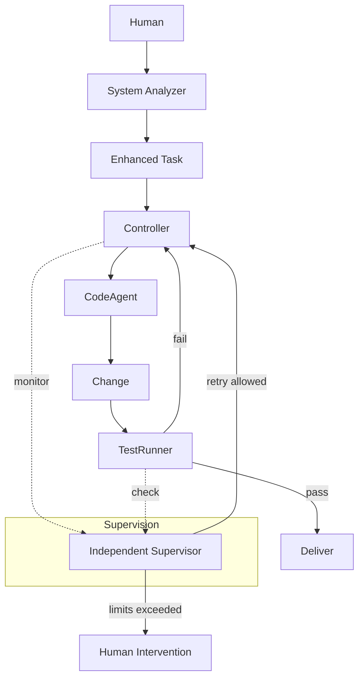
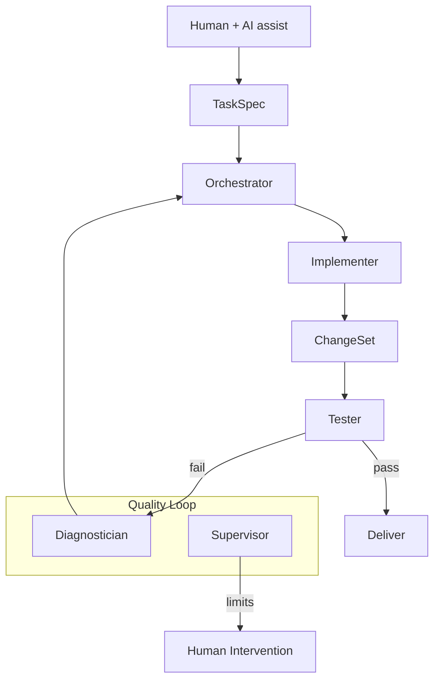
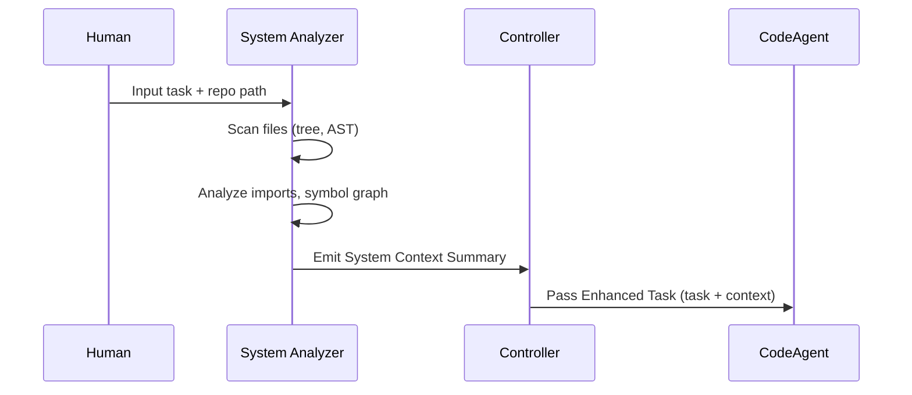
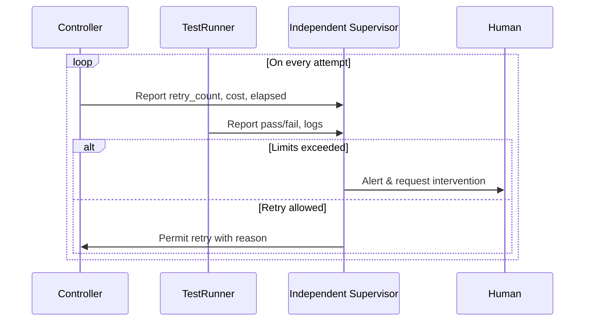
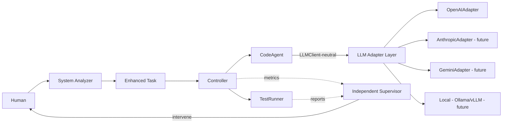

> 當前採用：MVP＋兩角色（v1.0）；完整雙層為 v2.0 目標

# Enhanced Architecture: MVP + Two Roles (System Analyzer, Independent Supervisor)

## High-level mapping (Complete two-layer vs. MVP+two-role)

- **Phase 1: Strategic Planning**
  - Complete: Strategic Planning (full) + System Analyzer + Docs/Observer Agents
  - MVP+: Simplified planning + System Analyzer (partial)
  - Priority: P1/P2
- **Phase 2: Tactical Execution**
  - Complete: Orchestrator + Implementer + Tester + Diagnostician + Supervisor
  - MVP+: Controller + CodeAgent + TestRunner + Independent Supervisor
  - Priority: P0 (core)

## Control flow (MVP+two-role)

## Control flow (Complete two-layer, reference)

## Component mapping table (concise)

- **Human (Architect)** ↔ **Human (Task Setter)**: direct mapping; human-in-the-loop stays primary.
- **System Analysis Agent** ↔ **System Analyzer**: direct mapping; Context Provider pattern.
- **Docs/Web Expert**: defer to v1.1.
- **Observer AI**: defer to v1.2.
- **TaskSpec** ↔ **Enhanced Task**: combined with system context.

- **Orchestrator** ↔ **Controller**: ~90% functional parity (coordination + state).
- **Implementer** ↔ **CodeAgent**: ~95% parity (code generation w/ context).
- **Tester** ↔ **TestRunner**: ~95% parity (execute tests, report).
- **Diagnostician** ↔ **Controller (basic)**: ~30% parity (basic retry/diagnostics in controller).
- **Supervisor** ↔ **Independent Supervisor**: ~60% parity (hard-threshold guardrails).

## System Analyzer (MVP scope)

- Code scanning: file tree + AST extraction.
- Dependency analysis: imports + function call graph (basic).
- Context summarization: < 1000 tokens, templated.
- Architecture suggestions: v1.1.

### System Analyzer data flow

## Independent Supervisor (MVP scope)

- Retry count: triggers at ≥ 3.
- Wall time: triggers at ≥ 30 minutes.
- Cost: API calls/tokens over budget.
- Quality metrics: v1.1.
- Strategy effectiveness: v1.1.

### Supervisor monitoring loop

## MVP+two-role with Adapter Layer (neutral interfaces)

## Roadmap (evolution)
- v1.0: MVP+two-role (System Analyzer + Independent Supervisor)
- v1.1: Enhanced Diagnostician (deeper error analysis)
- v1.2: Document Expert Agent
- v1.3: Observer AI
- v2.0: Full Strategic Planning layer
